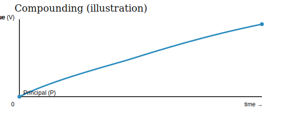

# Interest and Return

Interest is compensation that a borrower of capital pays to a lender of capital for its use.

---

## Key definitions

- Principal (P): the initial amount of money lent or invested.
- Future value (V): the amount the principal grows to after some time.
- Interest (I): the increase in value; I = V - P.

So, if an initial amount P grows to V, then

I = V - P

and equivalently

V = P + I

Often called:
 - interest earned
 - return on investment
 - coupon payment

---

## The time value of money

Generally, people prefer to have money now rather than the same amount of money at a later point in time.

## Inflationary expectations

## Alternative investments